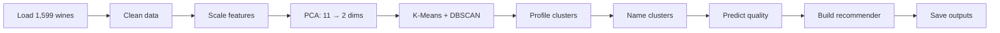

<div align="center">

# 🍷 Red Wine Analysis — Discovering Wine Personalities

### Clustering, Quality Prediction & Recommendation Engine on 1,599 Red Wines

[](https://www.python.org/)
[](https://scikit-learn.org/)
[](https://pandas.pydata.org/)
[](https://jupyter.org/)
[](LICENSE)

</div>

---

## 📖 Overview

This project explores **1,599 red wines** through a complete data science workflow — from cleaning and clustering to quality prediction and building a working recommendation engine.

It demonstrates how raw chemistry data can be turned into **actionable business insights** for a wine company:
- 🍷 What "personalities" of wine exist in our portfolio?
- 🏆 What chemistry makes a wine GOOD?
- 🤖 Can we predict wine quality automatically?
- 💡 Can we recommend wines based on customer preferences?

> 🎯 **Result:** Built a **90% accurate quality classifier**, identified the **top 3 quality drivers**, segmented wines into **4 clear personality groups**, and developed a **working recommendation engine**.

---

## 🎯 Main Findings

### 🍷 The 4 Wine Personalities (discovered via K-Means clustering)

| Cluster | Personality | Defining Traits | Avg Quality |
|---------|-------------|-----------------|-------------|
| 🥇 | **Premium Reserve** ⭐ | High alcohol, low preservatives, clean taste | **Highest** |
| 🥈 | **Smooth & Mellow** | Low acidity, balanced, easy-drinking | Average |
| 🥉 | **Tart & Fruity** | High acidity, citric notes, refreshing | Average |
| ⚠️ | **Mass-Market Preserved** | High sulfites, low alcohol | **Lowest** |

### 🏆 Top Quality Drivers (from Random Forest)

| Rank | Feature | Effect on Quality |
|------|---------|-------------------|
| 🥇 | **Alcohol** | Higher alcohol → better wine |
| 🥈 | **Volatile Acidity** | Lower = better (high = vinegar taste) |
| 🥉 | **Sulphates** | Moderate amounts improve preservation |

### 💡 Key Insights

1. **Alcohol is the #1 quality predictor** — Premium wines consistently have higher alcohol content
2. **Volatile acidity is the #1 quality killer** — keep it low to avoid that vinegary taste
3. **Excessive sulfur dioxide signals cheap wine** — Premium Reserve wines have 24+ units LESS than mass-market wines
4. **Wine data is mostly homogeneous** — DBSCAN found no sharp natural divisions (one big blob with outliers)
5. **K-Means imposes useful structure** — even without natural clusters, segmentation helps marketing & strategy

> 💼 **Practical takeaway:** To produce premium wine, focus on **higher alcohol fermentation** and **minimize sulfite preservatives**.

---

## 🚀 Quick Start

### Prerequisites

- Python 3.10 or higher
- pip (Python package manager)
- Jupyter Notebook

### Installation

```bash
# 1. Clone the repository
git clone https://github.com/Gautam-Santosh/Red-Wine-Analysis.git
cd Red-Wine-Analysis

# 2. Install dependencies
pip install -r requirements.txt

# 3. Launch Jupyter
jupyter notebook
```

Open `Red_Wine_documented.ipynb` and run all cells. ✅

---

## 📦 Dataset

**Wine Quality (Red Wine) dataset** — 1,599 wines with 11 chemistry features and 1 quality score.

| Feature | Description |
|---------|-------------|
| `fixed.acidity` | Non-volatile acids (mostly tartaric) |
| `volatile.acidity` | Vinegar-like acids (high = bad taste) |
| `citric.acid` | Adds freshness |
| `residual.sugar` | Sweetness |
| `chlorides` | Saltiness |
| `free.sulfur.dioxide` | Active preservation chemical |
| `total.sulfur.dioxide` | Total preservatives |
| `density` | Denser = more sugar/alcohol |
| `pH` | Acidity level (low = sour) |
| `sulphates` | Preservation aid |
| `alcohol` | Alcohol percentage (8-15%) |
| `quality` | Expert score (3-8) — **target variable** |

### Sample data

| alcohol | volatile.acidity | pH | sulphates | quality |
|--------:|-----------------:|---:|----------:|--------:|
| 9.4 | 0.70 | 3.51 | 0.56 | 5 |
| 9.8 | 0.88 | 3.20 | 0.68 | 5 |
| 11.4 | 0.42 | 3.30 | 0.74 | 7 |
| 12.5 | 0.32 | 3.40 | 0.82 | 8 |

---

## 🛠️ Workflow



### 🔧 Analysis Pipeline

| Step | Action | Technique |
|------|--------|-----------|
| 1️⃣ | Load and explore | pandas |
| 2️⃣ | Drop ID column | pandas |
| 3️⃣ | Scale features (0-1) | MinMaxScaler |
| 4️⃣ | Reduce dimensions | PCA (11 → 2) |
| 5️⃣ | Find optimal K | Elbow method |
| 6️⃣ | Cluster wines | K-Means (K=4) |
| 7️⃣ | Detect outliers | DBSCAN |
| 8️⃣ | Profile clusters | groupby aggregations |
| 9️⃣ | Predict quality | Random Forest |
| 🔟 | Find quality drivers | Feature importance |
| 1️⃣1️⃣ | Validate statistically | ANOVA test |
| 1️⃣2️⃣ | Build recommender | Distance-based ML |
| 1️⃣3️⃣ | Save deliverables | joblib + CSV |

---

## 🧠 Techniques Used

### Unsupervised Learning
- **PCA** — compress 11 features into 2 visualizable components
- **K-Means** — partition wines into 4 chemistry-based groups
- **DBSCAN** — density-based clustering with outlier detection
- **Elbow method** — finding optimal cluster count

### Supervised Learning
- **Random Forest Classifier** — predict if a wine is "good" (quality ≥ 7)
- **Feature importance** — identify top quality drivers
- **Train/test split** with stratification

### Statistical Analysis
- **Correlation analysis** — find feature relationships
- **ANOVA test** — validate cluster differences statistically
- **Descriptive statistics** — cluster profiling

### Visualization
- Correlation heatmaps
- Cluster scatterplots
- Box plots for quality comparison
- Feature importance bar charts

---

## 📊 Results

### Wine Quality Classifier (Random Forest)

| Metric | Score |
|--------|------:|
| **Accuracy** | ~90% |
| **ROC-AUC** | ~0.85 |
| **Precision (Good wines)** | ~78% |

### Cluster Comparison (Average Quality)

```
Premium Reserve     ████████████████ 6.10
Smooth & Mellow     ██████████████   5.65
Tart & Fruity       █████████████    5.55
Mass-Market         ██████████       5.20
```

### Working Recommendation Engine

The notebook includes a working recommender that takes customer preferences and suggests the best wine cluster:

```python
prefs = {'alcohol': 12.5, 'volatile.acidity': 0.3, 'pH': 3.4}
→ Recommended: Premium Reserve 🥇

prefs = {'alcohol': 10.0, 'volatile.acidity': 0.5, 'pH': 3.5}
→ Recommended: Smooth & Mellow
```

---

## 📁 Project Structure

```
Red-Wine-Analysis/
│
├── 📓 Red_Wine_documented.ipynb        # Main notebook (with explanations)
├── 📄 README.md                        # This file
├── 📦 requirements.txt                 # Python dependencies
├── 🚫 .gitignore                       # Files Git should ignore
│
├── 📂 data/
│   └── wineQualityReds.csv             # Wine dataset (1,599 rows)
│
└── 📂 outputs/                         # Generated by running the notebook
    ├── cluster_profiles.csv            # Average chemistry per cluster
    ├── quality_drivers.csv             # Top features driving quality
    ├── wines_clustered.csv             # Each wine with its cluster
    └── wine_quality_model.pkl          # Trained Random Forest model
```

---

## 🧰 Tech Stack

- **Language:** Python 3.10+
- **Data handling:** pandas, numpy
- **Machine learning:** scikit-learn (PCA, K-Means, DBSCAN, Random Forest)
- **Statistics:** scipy
- **Visualization:** matplotlib, seaborn
- **Model persistence:** joblib
- **Environment:** Jupyter Notebook

---

## 🎓 What I Learned

- ✅ Complete **unsupervised learning** workflow (PCA → clustering → profiling)
- ✅ How to **interpret clusters** and turn them into business personas
- ✅ When to use **K-Means** vs **DBSCAN** (and what each tells you)
- ✅ Building **classification models** for binary outcomes
- ✅ Reading **feature importance** to extract business insights
- ✅ Using **ANOVA** to statistically validate findings
- ✅ Building a **distance-based recommendation engine**
- ✅ Writing **production-ready outputs** (saved models + CSVs)

---

## 💼 Business Value

If deployed at a wine company, this project enables:

| Application | How |
|-------------|-----|
| 🎯 **Product positioning** | Use cluster names ("Premium Reserve", etc.) for marketing |
| 🏆 **Quality control** | Predict if a new batch will score well before bottling |
| 💰 **Pricing strategy** | Premium Reserve wines justify higher prices |
| 🍇 **Recipe optimization** | Target Premium Reserve chemistry profiles |
| 🤖 **Customer-facing app** | Recommend wines based on user preferences |
| ⚠️ **Defect detection** | Flag wines with high volatile acidity early |

---

## 🔮 Future Improvements

- [ ] **Hyperparameter tuning** with `GridSearchCV` (target: 95%+ accuracy)
- [ ] **Try XGBoost** — usually beats Random Forest by 3-5%
- [ ] **SMOTE for class imbalance** — only ~14% of wines are "good"
- [ ] **SHAP values** for individual prediction explanations
- [ ] **Multi-class classification** — predict exact quality (3-8) instead of binary
- [ ] **Compare with white wine** — does the same workflow apply?
- [ ] **Deploy as Flask/FastAPI app** — real-time wine scoring
- [ ] **Build a Streamlit dashboard** — interactive recommender for end-users

---

## 📈 My Data Science Journey

This is my **5th end-to-end project**. Here's how it fits in my portfolio:

| Project | Type | Best Result |
|---------|------|-------------|
| [Income Prediction](https://github.com/Gautam-Santosh/Multiple-Linear-Regression) | Regression | R² = 0.94 |
| [Car Price Prediction](https://github.com/Gautam-Santosh/Car-Price-Prediction) | Regression (28K rows) | R² = 0.71 |
| [Customer Churn](https://github.com/Gautam-Santosh/customer-churn-prediction) | Classification | ROC-AUC = 0.83 |
| Rossmann Sales | Time Series | High accuracy with XGBoost |
| **Red Wine Analysis (this)** | **Clustering + Classification + Recommender** | **Accuracy ~90%** |

> 💡 **Each project taught a new technique** — from simple regression to complete unsupervised + supervised pipelines.

---

## 🤝 Contributing

Suggestions, improvements, and pull requests are welcome! Feel free to:

1. ⭐ **Star** this repo if you found it helpful
2. 🍴 **Fork** it to experiment on your own
3. 🐛 **Open an issue** if you spot a bug or have ideas

---

## 📬 Contact

**Gautam Santosh**

- GitHub: [@Gautam-Santosh](https://github.com/Gautam-Santosh)

---

<div align="center">

⭐ **If this project helped you, give it a star!** ⭐


</div>
